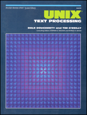

# Unix Text Processing

*UTP is one of the best books on Unix from a user's perspective.*  
– Jack Redman

Originally published in 1987,
Unix Text Processing (UTP) (written by Dale Dougherty and Tim O'Reilly)
provides one of the few comprehensive looks at all the tools
involved in a typical *troff*-based writing workflow.
It covers:

-   UNIX and *troff* basics
-   text editors (*vi*, *ex*, and *sed*)
-   the *ms* and *mm* macro packages
-   scripting with *sh*, *awk*, and *sed*
-   the *tbl*, *eqn* and *pic* preprocessors
-   macro writing

The appendices provide a collection of reference material and other
useful pointers.

UTP was originally published by Hayden Books (which was acquired by
Howard W. Sams before the book was actually published).
In the early 21^st^ century, the authors made the book available at
the [Open Books Project](http://www.oreilly.com/openbook/)
under the Creative Commons
[Attribution License](http://creativecommons.org/licenses/by/1.0).
Scanned pages are [available](ftp://ftp.oreilly.com/pub/utp/) in
PBM (Portable BitMap) and PDF formats.
The original [troff](http://troff.org/) markup is lost.

In 2002,
some members of the [GNU Troff](https://www.gnu.org/software/groff/)
(*groff*) mailing list
began transcribing the book and recreating the source code.
It took a little over a year of manic activity,
punctuated by long naps,
and we released "UTP Revival" in 2004.
We still hope to modernize the book ("UTP Revisited").
Whether you want to use GNU Troff,
or Plan 9 or one of its derivatives (Heirloom Troff and Neatroff),
UTP is still an excellent guide to the nuts and bolts of print publishing.

The current (main) branch is UTP 1.1,
which provides a clickable index, TOC, and cross-references within the PDF
(thanks to Deri James).
You will need *groff* 1.22 or newer to format it,
as it uses the -Tpdf driver.
If you have an older *groff*, switch to the 1.0 branch.

The UTP Revival Release is
distributed according to the terms of the
Creative Commons Attribution License.
A copy of the license is available at
[http://creativecommons.org/licenses/by/1.0](http://creativecommons.org/licenses/by/1.0).

**Note**: The transcription project predated Plan 9 and its derivatives.
Thus, the recreated source and macros were written for *groff*,
and we made no attempt to be compatible with the original *troff*.
Patches for Heirloom or Neatroff (if needed) are welcome!

------------------------------------------------------------------------

## Acknowledgements

-   First, a big thanks to the original authors
    for making the book available in the first place.
    Nothing else could have happened without that first step.
-   Jon Snader provided the scripts to build the table of contents.
-   Michael Hobgood and Andreas Kähäri handled proofreading chores.
-   Deri James added PDF links for the contents and index.

Individuals who worked on various chapters:

| Chapter Title                       | Transcriber         | Markup              | Indexing            |
|-------------------------------------|---------------------|---------------------|---------------------|
| Front matter                        | Ralph Corderoy      | Ralph Corderoy      | n/a                 |
| Preface                             | Stewart Russell     | Larry Kollar        | n/a                 |
| From Typewriters to Word Processors | Stewart Russell     | Michael Hobgood     | Michael Hobgood     |
| UNIX Fundamentals                   | Stewart Russell     | Michael Hobgood     | Heinz-Jürgen Oertel |
| Learning vi                         | Heinz-Jürgen Oertel | Heinz-Jürgen Oertel | Jack Redman         |
| nroff and troff                     | Colin Watson        | Michael Hobgood     | Heinz-Jürgen Oertel |
| The ms macros                       | Larry Kollar        | Larry Kollar        | Larry Kollar        |
| The mm macros                       | Larry Kollar        | Larry Kollar        | Larry Kollar        |
| Advanced Editing                    | Heinz-Jürgen Oertel | Heinz-Jürgen Oertel | Jack Redman         |
| Formatting with tbl                 | Michael Hobgood     | Michael Hobgood     | Michael Hobgood     |
| Typesetting Equations with eqn      | Michael Hobgood     | Michael Hobgood     | Jack Redman         |
| Drawing Pictures                    | Michael Hobgood     | Michael Hobgood     | Jack Redman         |
| A Miscellany of UNIX Commands       | Manas Laha          | Manas Laha          | Manas Laha          |
| Let the Computer do the Dirty Work  | Larry Kollar        | Larry Kollar        | Larry Kollar        |
| The awk Programming Language        | Larry Kollar        | Larry Kollar        | Jack Redman         |
| Writing nroff and troff Macros      | Michael Hobgood     | Michael Hobgood     |                     |
| Figures and Special Effects         | Michael Hobgood     | Michael Hobgood     | Larry Kollar        |
| What's in a Macro Package?          | Michael Hobgood     | Michael Hobgood     |                     |
| An Extended ms Macro Package        | Michael Hobgood     | Michael Hobgood     |                     |
| Putting it All Together             | Michael Hobgood     | Michael Hobgood     | Michael Hobgood     |
| Editor Command Summary              | Heinz-Jürgen Oertel | Heinz-Jürgen Oertel | Heinz-Jürgen Oertel |
| Formatter Command Summary           | Manas Laha          | Manas Laha          | Manas Laha          |
| Shell Command Summary               | Ralph Corderoy      | Ralph Corderoy      |                     |
| Format of troff Width Tables        | Ralph Corderoy      | Ralph Corderoy      |                     |
| Comparing mm and ms                 | Ralph Corderoy      | Ralph Corderoy      |                     |
| The format Macros                   | Ralph Corderoy      | Ralph Corderoy      |                     |
| Selected Readings                   | Ralph Corderoy      | Ralph Corderoy      |                     |

